# 基本物性集成计算平台 — 毕业论文用系统图

> 本文档含论文章节 **5.8** 正文草稿及配套 Mermaid 图，可直接在 [Mermaid Live Editor](https://mermaid.live)、Typora、VS Code（Mermaid 插件）或 Word（经导出 PNG/SVG）中使用。  
> 导出建议：每张图单独渲染为 **SVG/PNG（300dpi）**，图题按学校格式编号。

---

## 5.8 部署与运行流程展示

基本物性集成计算平台采用 **前后端分离、多进程协同** 的架构：浏览器侧为基于 React + TypeScript 的单页应用（SPA），服务端由 **Python 业务服务**（`pyserver.py`，默认端口 3569）、**Rust 用户服务**（`database/main.rs`，端口 8088）及 **WebSocket 终端服务**（默认端口 8765）共同承担接口与计算任务，持久化数据存放于 **MySQL**，并可选对接 **Materials Project（MP）外部 API**。生产环境通过 **Nginx** 统一对外提供 HTTPS 与反向代理，由 **systemd** 托管后端进程，部署于阿里云 Linux 云主机。

本节从两个维度说明系统如何落地与如何运转：

| 小节 | 内容侧重 | 对应插图 |
|------|----------|----------|
| **5.8.1 部署流程** | 开发联调 → 构建打包 → 云服务器配置 → 域名与证书发布 | 图 5-8-1、图 5-8-2 |
| **5.8.2 运行流程** | 进程启动、前端路由与 API 调用、HTTP 路由分发、典型业务链路 | 图 5-8-3～图 5-8-8 |

图 5-8-1 给出从本地开发到对外发布的完整部署流水线；图 5-8-2 描述生产环境下 Nginx 与各后端端口的分工。运行流程则区分 **代码级执行路径**（程序启动、路由、函数调用）与 **用户业务路径**（登录、检索、可视化），便于读者理解「机器如何跑」与「用户如何用」两层含义。

---

## 5.8.1 部署流程

部署流程分为 **开发环境验证**、**构建与打包**、**云服务器部署**、**对外发布** 四个阶段，如图 5-8-1 所示。

### （1）开发环境

开发者在本地维护 `web/`（前端）与 `server/`（后端）代码。前端通过 `npm run dev` 启动 Vite 开发服务器（默认 5173 端口），`vite.config.ts` 将 `/api`、`/page2_search`、`/mysql_receive` 等路径代理至 Python 服务（`VITE_PYTHON_API_ORIGIN`，默认 `http://127.0.0.1:3569`），将 `/register`、`/login` 等请求代理至 Rust 服务（8088），从而避免浏览器跨域限制。后端在 `server/` 目录执行 `python pyserver.py`（或项目提供的 `scripts/start-all.ps1` / `start-all.sh`）进行联调；`pyserver.py` 在启动时可按环境变量 `TSX_SKIP_RUST_SERVER` 决定是否通过子进程拉起 Rust 可执行文件。本阶段完成页面功能、接口契约与数据库查询的正确性验证后，进入构建环节。

### （2）构建与打包

构建阶段并行完成三类产物：

- **前端静态资源**：在 `web/` 目录执行 `npm run build`，由 Vite 将 TypeScript/React 源码编译打包为 `web/dist/` 下的 HTML、JS、CSS 等静态文件，供 Nginx 直接托管。
- **Rust 用户服务（可选但生产推荐）**：在 `server/database/` 执行 `cargo build --release`，生成 `target/release/database` 可执行文件，负责注册、登录及用户相关 JSON 文件读写（`users.json`、`compounds.json`）。
- **Python 运行环境**：在服务器或虚拟环境中执行 `pip install -r server/requirements.txt`，安装 `mysql-connector`、`websockets`、`pymatgen` 等业务依赖。

三类产物共同构成可部署的 **后端运行包**（`server/` 目录 + 虚拟环境 + Rust 二进制）与 **前端发布包**（`web/dist`）。

### （3）云服务器部署

生产环境部署于 **阿里云 Linux** 实例，典型目录为 `/opt/cal_web/Cal_web`（与项目 `deploy/` 示例配置一致）。主要步骤如下：

1. **代码与产物就位**：将仓库或发布包上传至服务器；将本地构建的 `web/dist` 拷贝至服务器对应路径，作为 Nginx 的 `root`。
2. **数据库初始化**：执行 `deploy/mysql-init.sql` 创建库表，并按 `deploy/mysql-import.md` 导入 `materials`、`element_inf` 等基础数据，供 `page2_search_db()`、`data_in_mysql()` 等接口查询。
3. **环境变量配置**：设置 `MP_API_KEY`（Materials Project 密钥）、MySQL 连接参数、`PY_HTTP_PORT`（默认 3569）、`TERMINAL_WS_PORT`（默认 8765）等；若需独立调试可设置 `TSX_SKIP_RUST_SERVER=1` 跳过 Rust 子进程（生产环境注册/登录仍建议保留 Rust 服务）。
4. **systemd 托管后端**：将 `deploy/calweb-backend.service.example` 复制为 `/etc/systemd/system/calweb-backend.service`，指定 `WorkingDirectory` 为 `server/`、`ExecStart` 为虚拟环境中的 `python pyserver.py`，执行 `systemctl enable --now calweb-backend` 实现开机自启与故障重启。
5. **Nginx 反向代理与静态托管**：参考 `deploy/nginx-calweb.conf.example` 配置 SSL、静态根目录及路由转发（见图 5-8-2）：443 端口对外；`/register`、`/login`、`/users/*` → `127.0.0.1:8088`；`/api/*` 及 `/page2_search`、`/mysql_receive` 等旧路径 → `127.0.0.1:3569`；`/api/ssh/ws` → `127.0.0.1:8765`（WebSocket 须写在 `/api/` 通用规则之前）；其余路径回退至 SPA 的 `index.html`。
6. **部署验证**：运行 `deploy/verify-api.sh` 检查关键 HTTP 接口与 Rust `/health` 是否可达。

### （4）对外发布

将域名（如 `calweb.physedu.top`）解析至云主机公网 IP；使用 **Let's Encrypt** 申请 HTTPS 证书并写入 Nginx 配置。用户通过浏览器访问 `https://域名/` 即可加载前端静态资源；所有 API 请求经 Nginx 同源转发至本机后端，无需在前端暴露多端口，兼顾安全性与可维护性。

**图 5-8-1** 系统生产环境部署流程（见下文「图 1」Mermaid 源码）  
**图 5-8-2** 生产环境部署架构（见下文「部署架构」Mermaid 源码）

---

## 5.8.2 运行流程

运行流程从 **服务进程启动**、**前端代码执行**、**后端请求分发**、**典型 API 调用链** 以及 **用户业务操作** 五个层次展开，与开发环境相比，生产环境仅将 Vite 开发代理替换为 Nginx 同源反向代理，应用内调用链保持一致。

### （1）后端进程启动与并发模型

`pyserver.py` 作为主控入口，在 `if __name__ == '__main__'` 中首先执行 `os.chdir(SERVER_ROOT)`，将工作目录切换至 `server/`，保证相对路径（静态资源、子进程、数据文件）解析正确。随后并行启动三类能力（图 5-8-3）：

| 组件 | 实现方式 | 默认端口 | 职责 |
|------|----------|----------|------|
| HTTP 业务服务 | `threading.Thread` → `run_http_server()` | 3569 | `ReuseAddrTCPServer` + `MyRequestHandler`，处理检索、拟合、数字孪生、数据录入等 |
| WebSocket 终端 | `threading.Thread(daemon=True)` → `run_websocket_server()` | 8765 | `asyncio` + `websockets`，支撑远程终端能力 |
| Rust 用户服务 | `subprocess.Popen`（或跳过） | 8088 | `FileDatabase::load` 后由 Actix-web 注册 `/register`、`/login`、`/users/*`、`/compounds/*` 并阻塞监听 |

主线程对 HTTP 与 WebSocket 线程执行 `join()`，保持进程存活；Rust 子进程独立监听 8088，与 Python 线程模型解耦，避免阻塞 Python 的 `serve_forever()` 循环。

Rust 侧启动顺序为：`main()` → `FileDatabase::load(users.json, compounds.json)` → `HttpServer::new` 注册路由 → `.bind("0.0.0.0:8088").run()` 进入事件循环（图 5-8-4）。

### （2）前端 SPA 代码执行路径

用户打开站点后，浏览器加载 `index.html`，由 `main.tsx` 调用 `ReactDOM.createRoot().render()` 挂载应用；`BrowserRouter` 解析 URL，`App.tsx` 根据路由表渲染 `pages/*.tsx` 中对应页面（首页、可视化、登录、数字孪生等）。页面组件通过 `api/pythonApi.ts`、`api/rustApi.ts` 发起业务请求，统一经 `api/http.ts` 的 `requestJson()` 封装为 `fetch` 调用（图 5-8-5）：

- **开发环境**：Vite `server.proxy` 将 `/api` 等前缀转发至 Python 3569，Rust 相关路径需在本地另行代理或直连 8088。
- **生产环境**：浏览器仅访问 Nginx 443 同源路径，由 Nginx 按 URL 前缀分发至 Python 或 Rust，前端无需修改 base URL。

### （3）Python HTTP 请求分发

每个到达 3569 端口的 TCP 连接由 `MyRequestHandler` 处理：根据 HTTP 方法进入 `do_GET`、`do_POST`、`do_PUT` 或 `do_OPTIONS`（CORS 预检）；`parse_path()` 解析路径后进入分支逻辑（图 5-8-6）。典型路由包括：

- **GET**：`/api/data` → `get_data()` 查询元素/材料并返回 JSON；`/api/digital_twin/*` → 数字孪生相关处理；其余可走静态文件服务。
- **POST**：`/page2_search` → `page2_search_db()` 联合查询 MySQL 的 `element_inf` 与 `u_nb_database.materials`；`/mysql_receive` → `data_in_mysql()`，失败时回退 `data_in_u_nb_materials()`；`/create_lattice_picture` → ASE 生成晶格图；`/api/submit`、`/data_input/submit` 等处理表单与申请队列。

响应统一 `send_response(200)` 并 `wfile.write(JSON)`，在 `end_headers()` 中设置 `Access-Control-Allow-Origin: *`，便于开发期跨域（生产由同源代理弱化跨域需求）。

### （4）典型 API 函数调用链（材料检索）

以可视化页 `fetchBarMaterials()` 为例，前端并行调用 `pythonApi.page2Search`、`pythonApi.mysqlReceive`、`pythonApi.submitElement` 与 `pythonApi.queryData`，后者触发 MP 相关逻辑并经 `parseMpApiMaterials()`、`matchesSelectedSymbols()` 合并筛选（图 5-8-7）。后端对应关系为：

- `POST /page2_search` → `page2_search_db()` → `_page2_build_where()` 构造 SQL → 查询 `element_inf` / `materials` 表 → 可选 `page2_search_mp()`；
- `POST /mysql_receive` → `data_in_mysql()` → 必要时 `data_in_u_nb_materials()`；
- `GET /api/data` → `get_data()` → `_build_chemsys_from_element()` → `MPRester.materials.summary.search()`（当 `MP_API_KEY` 可用且外网可达时），否则依赖本地缓存或仅返回库内数据。

该链路体现了 **「本地 MySQL + 外部 MP-API + 前端聚合过滤」** 的多源数据策略；若 MP-API 超时或不可用，系统可降级为读取本地缓存结果，保证基本检索能力（见 5.8.2 第（5）节）。

### （5）用户业务运行流程（端到端）

从用户视角，一次完整使用流程如图 5-8-8 所示：

1. **访问与认证**：用户通过 HTTPS 打开站点；`authStore` 判断是否已登录。若否，进入 `LoginPage`，调用 `rustApi.login()` → `POST /login` → Rust `login()` handler → `FileDatabase::verify(users.json)`，成功后将登录态写入本地存储并返回主界面（图 5-8-9）。
2. **元素检索**：用户在可视化等页面选择元素生成 `elementFormula`（如 Zr-Nb），点击搜索后前端并行请求：Python `POST /page2_search` 查询本地库；`POST /mysql_receive` 补充材料行；`GET /api/data` 尝试拉取 MP 摘要数据。
3. **数据融合与筛选**：前端合并多源结果，按 `matchesSelectedSymbols` 过滤，展示材料列表供用户点选。
4. **参数与可视化**：用户配置晶格、结构等参数；若需晶格图，则 `POST /create_lattice_picture`，后端多线程渲染后返回图像路径或数据。
5. **结果展示**：最终在页面呈现物性数据、图表或三维结构，完成一次业务闭环。

上述运行流程与部署流程相衔接：部署阶段确定的端口、Nginx 路由与 systemd 服务名，正是运行阶段各请求能够正确抵达 Python/Rust 进程的前提。

**插图索引（论文章节 5.8 引用）**

| 图号建议 | 内容 | 文档内位置 |
|----------|------|------------|
| 图 5-8-1 | 系统生产环境部署流程 | 下文「图 1」 |
| 图 5-8-2 | 生产环境部署架构 | 下文「部署架构」 |
| 图 5-8-3 | `pyserver.py` 启动与并发 | 下文「图 2-1」 |
| 图 5-8-4 | Rust `main.rs` 启动 | 下文「Rust 用户服务」 |
| 图 5-8-5 | 前端 SPA 执行路径 | 下文「图 2-2」 |
| 图 5-8-6 | Python HTTP 路由分发 | 下文「图 2-3」 |
| 图 5-8-7 | 材料检索 API 调用链 | 下文「图 2-4」 |
| 图 5-8-8 | 用户业务端到端流程 | 下文「图 2-6」 |
| 图 5-8-9 | 登录接口调用链 | 下文「图 2-5」 |

---

## 图 1 系统部署流程图

**图题示例**：图 X-X 系统生产环境部署流程

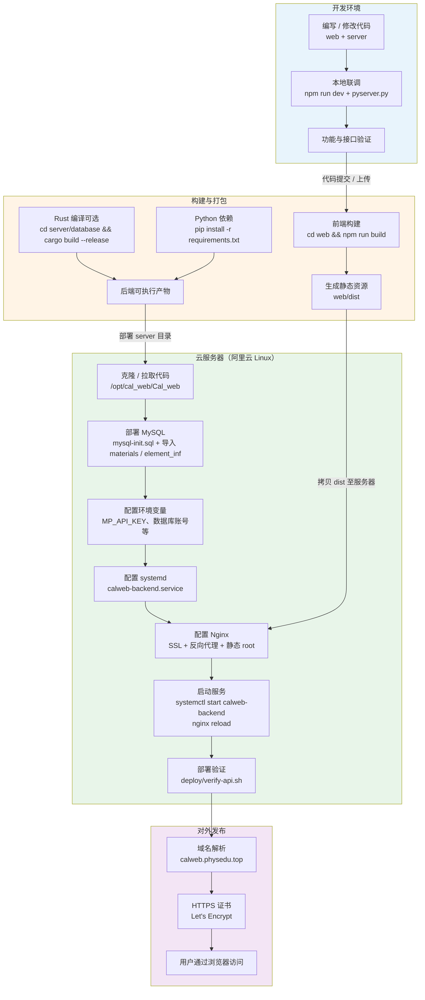

**部署架构（可作插图补充）**：

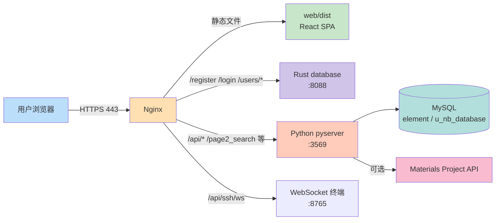

---

## 图 2 系统运行流程图（代码执行）

**图题示例**：图 X-X 系统代码运行流程

以下从 **程序启动 → 前端调用链 → 后端路由分发 → 典型函数调用** 描述代码实际执行路径（非用户业务操作步骤）。

---

### 图 2-1 后端程序启动与并发模型（`pyserver.py`）

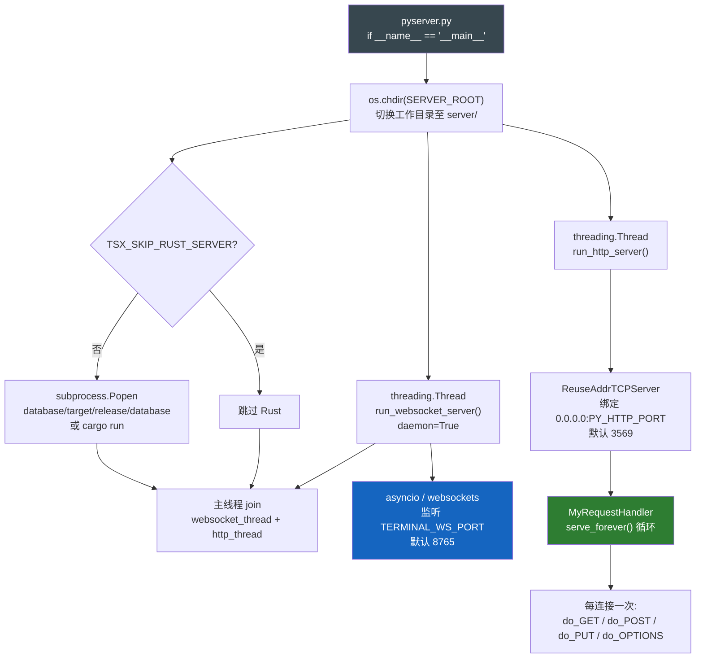

**Rust 用户服务并行启动**（`database/main.rs`）：

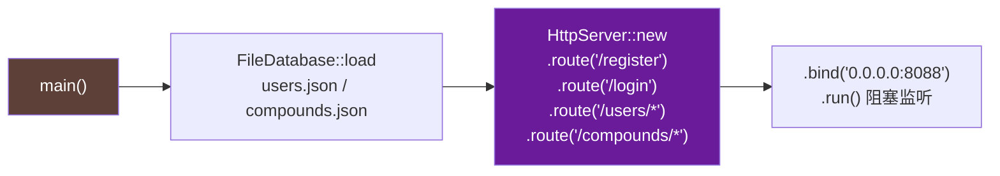

---

### 图 2-2 前端 SPA 代码执行流程

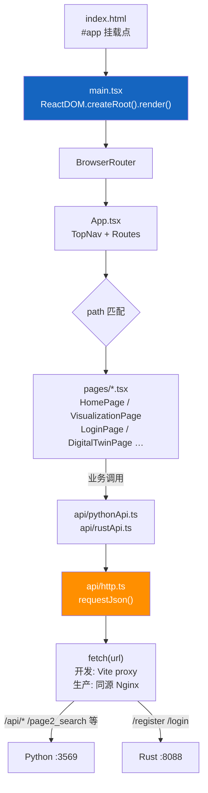

**Vite 开发时代理**（`vite.config.ts`）：`/api` → `VITE_PYTHON_API_ORIGIN`；`/page2_search`、`/mysql_receive` 等同理。

---

### 图 2-3 Python HTTP 请求分发（`MyRequestHandler`）

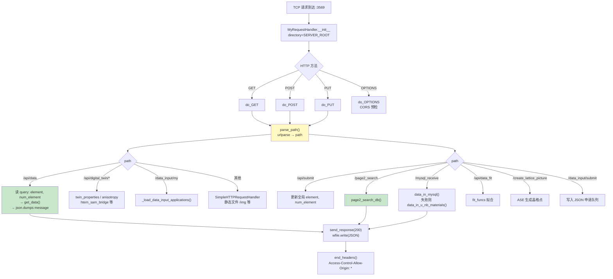

---

### 图 2-4 典型 API 函数调用链（材料检索相关）

以 `VisualizationPage.tsx` → `fetchBarMaterials()` 为例，展示 **前后端函数级** 调用顺序。

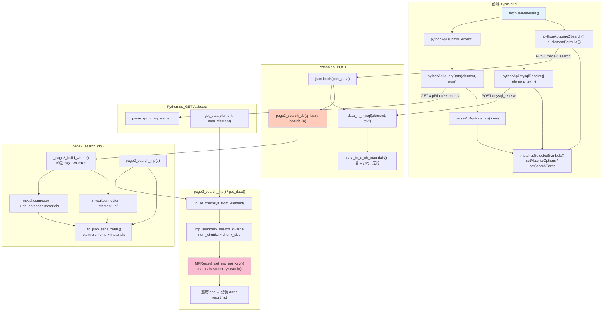

---

### 图 2-6 用户业务端到端运行流程

**图题示例**：图 X-X 用户业务运行流程（登录—检索—可视化）

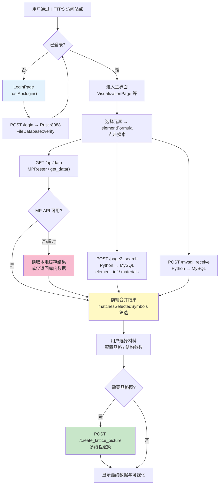

---

### 图 2-5 登录接口代码调用链（Rust）

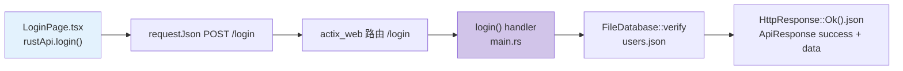

---

**与图 1 的区别**：图 1 描述 **部署到服务器** 的步骤；图 2 描述 **源代码运行时** 的进程、线程、路由与函数调用关系，图 2-6 补充 **用户业务视角** 的端到端流程。论文 5.8.2 建议选用 **图 2-1 + 图 2-3 + 图 2-6** 作为运行流程主体，技术细节可辅以图 2-4、图 2-5。

---

## 图 3 项目代码结构图

**图题示例**：图 X-X 系统代码目录结构

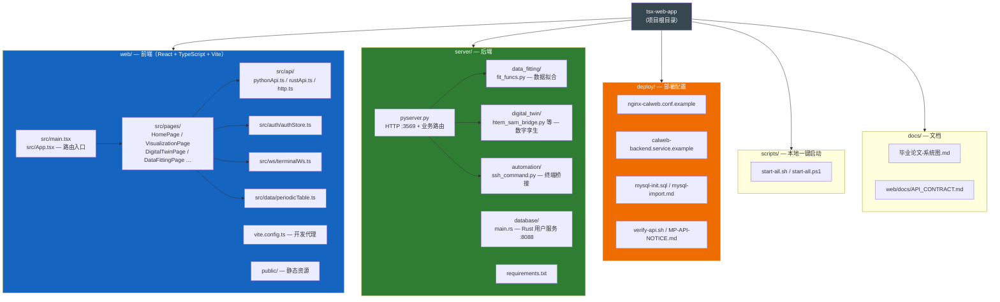

**模块依赖关系（逻辑结构）**：

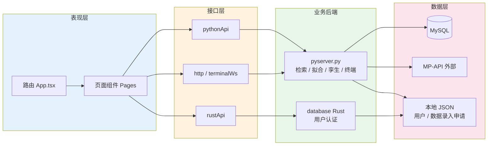

---

## 使用说明（写入论文时）

| 步骤 | 说明 |
|------|------|
| 1 | 复制对应 ` ```mermaid ` 代码块到编辑器 |
| 2 | 导出为 PNG/SVG，宽度建议 12–16 cm（单栏）或通栏 |
| 3 | 图题、图注按学校规范编号；可在图注中注明「部署环境：Nginx + systemd + 阿里云」 |
| 4 | 若 MP-API 仍封禁，运行流程图中可将 MP 分支标注为「可选 / 当前生产环境暂不可用」 |

**目录对照（便于正文引用）**

| 论文章节 | 对应图 |
|----------|--------|
| **5.8** 部署与运行流程展示 | 图 5-8-1～5-8-2（总览）；正文见上文 §5.8 |
| **5.8.1** 部署流程 | 图 5-8-1 部署流程图 + 图 5-8-2 部署架构图 |
| **5.8.2** 运行流程 | 图 5-8-3～5-8-4 进程启动；图 5-8-5～5-8-7 代码路径；图 5-8-8～5-8-9 业务与登录 |
| 系统总体结构 / 模块划分 | 图 3 目录结构图 + 模块依赖图 |
